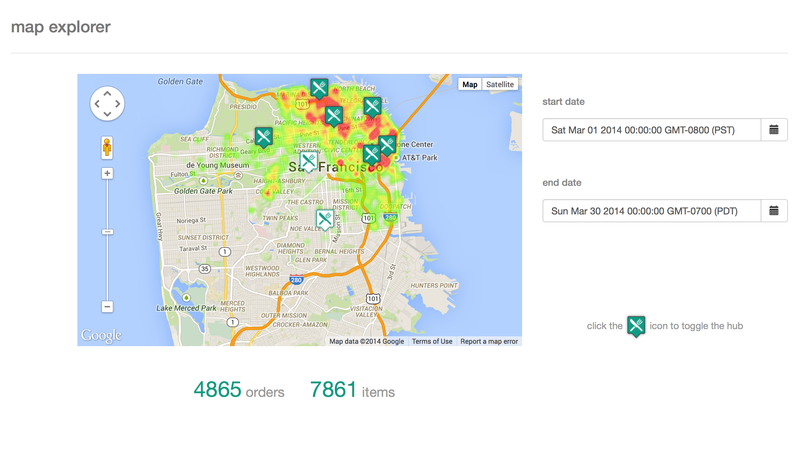

map-challenge
=============

This is a simple web app for analyzing data on a map

##Running

To run this web app, you will need the following installed on the server (or locally):

* mongodb

        brew install mongodb

* npm

        brew install npm

* grunt

        npm install -g grunt-cli

* bower

        npm install -g bower

Once all of these tools are installed, you will need to start 3 processes: the database, the rest server, and the web app server.

###Database

To start the mongo database, run the following command:

    mongod --dbpath <path-to-database>

Once the mongo daemon is running, you will need to import the data (note that a header line needs to be added to the hubs.csv file: id,lat,long):

    mongoimport -d orderdb -c hubs --type csv --file hubs.csv --headerline

    mongoimport -d orderdb -c orders --type csv --file orders.csv --headerline
    mongo orderdb --eval "db.orders.find().forEach(function(doc){doc.created_at = new ISODate(doc.created_at);db.orders.save(doc)});"
    mongo orderdb --eval "db.orders.ensureIndex({hub_id: 1, created_at: 1});"

Now the database is ready to be used with the app

###Rest Server

To start the rest server, go to the map-challenge-server directory and run the following commands:

    npm install
    node orderService.js

Now the rest server is running, which will allow the app to query the database through rest endpoints

###Web App Server

To start the web app server, go to the map-challenge-client directory and run the following commands:

    bower install (choose option #3 when prompted about angular version, ^1.3.0)
    npm install
    grunt serve

Now the web app will be running on port 9000. If running locally, you can now navigate to localhost:9000 in your browser to launch the web app
